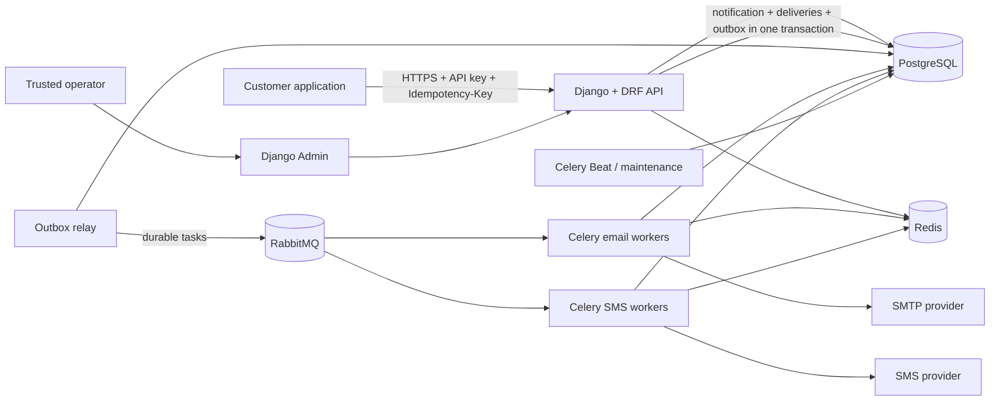

# NotificationOS MVP Implementation Plan

- **Source:** `NotificationOS_PRD_v2.md`
- **Backend:** Django + Django REST Framework (DRF)
- **Architecture:** Modular monolith with Celery background workers
- **Status:** Phase 1 complete; architecture decisions and initial tenancy
  implementation complete; catalogue work next
- **Last updated:** 2026-07-23

## 1. Outcome

Build a production-minded MVP that lets a business:

1. Register notification event types.
2. Create and manage versioned templates.
3. Register recipients and their channel preferences.
4. Trigger a notification through an authenticated API.
5. Deliver it asynchronously through email and one additional channel.
6. Retry transient failures without creating duplicate logical notifications.
7. Inspect the complete delivery history.

The MVP will use one Django codebase, one PostgreSQL database, and clear Django
app boundaries. The HTTP application, outbox relay, Celery workers, and
scheduled maintenance jobs will be separate runtime processes from the same
release. They are not independent microservices.

This approach is intentional. It gives the core notification flow transactional
consistency and keeps local development, testing, deployment, and debugging
fast. A module will only be extracted into a service later when real scaling,
release cadence, ownership, or isolation requirements justify it.

## 2. MVP Boundaries

### Included

- Multi-tenant data isolation using `business_id`.
- Tenant API keys with scopes, rotation, and revocation.
- Notification event/category CRUD.
- Versioned email and second-channel templates.
- Safe variable substitution with validation.
- Recipient records and per-category, per-channel preferences.
- Required caller-supplied idempotency keys.
- Asynchronous provider delivery.
- Email plus one additional channel.
- One provider per channel.
- Fixed retry count and fixed retry delay.
- Delivery and attempt history.
- Per-tenant admission limits and per-recipient send limits.
- Queue fairness so one tenant cannot starve another.
- Encrypted provider credentials.
- Minimal append-only audit records for sensitive changes.
- Retention, deletion, and anonymization jobs.
- Health checks, structured logs, metrics, and tracing context.
- OpenAPI documentation and a developer quickstart.

### Excluded

- Multi-step workflows and conditional branches.
- Scheduling and recurring reminders.
- Provider failover.
- Open/click analytics dashboards.
- Notification-center UI, read/unread state, archive, and search.
- Slack, Discord, Teams, WhatsApp, and Telegram.
- Localization unless selected before implementation.
- Attachments and large media payloads.
- SSO, enterprise RBAC, audit-log UI/export, private deployments, and SLAs.
- Kubernetes, a service mesh, and separate service databases.

## 3. Decisions Required

The following decisions must be recorded as short architecture decision records
under `docs/adr/`. Recommended defaults are provided so development can begin
quickly, but the product owner should approve them.

| Decision | Recommended MVP default | Required by |
|---|---|---|
| Differentiation | Simple, developer-first, self-hostable notification core for small SaaS teams | Public beta |
| Second channel | SMS; in-app delivery would pull notification-center behavior from v2 into v1 | Feature development |
| Initial providers | SMTP-compatible email adapter and Twilio-compatible SMS adapter | Provider work |
| Provider ownership | Tenant brings its own provider credentials; platform-managed sending is deferred | Provider work |
| Local providers | Mailpit for email and a deterministic fake SMS adapter | Foundation |
| Recipient identity | Tenant-defined `external_id`; persist normalized contacts as encrypted PII with keyed lookup hashes where needed | Recipient work |
| Preference policy | Optional categories honor opt-out; explicitly classified mandatory transactional/security categories are not offered as opt-out | Preference work |
| Missing preference | Transactional enabled by default; marketing disabled until explicit opt-in | Preference work |
| Retry policy | Three total attempts: initial attempt plus two retries, with a fixed 60-second delay | Delivery work |
| `sent` meaning | The provider accepted the request; it does not mean opened, read, or handset-delivered | API contract |
| Idempotency window | Keep active keys for 30 days; retain a non-PII tombstone for 90 days | Trigger API |
| Idempotency conflict | Same key and same canonical payload returns the original result; same key with different data returns `409` | Trigger API |
| Content retention | Encrypt stored payload/rendered content and erase it after 30 days | Production launch |
| Metadata retention | Keep non-PII delivery metadata for 90 days | Production launch |
| Human administration | Django Admin for trusted internal operators; tenant-facing management remains API-first | Foundation |
| Provider callbacks | Defer delivered/bounced callbacks unless a pilot customer requires them | Public beta |
| Rate and volume limits | Define numerical tenant, recipient, payload, and plan limits before load testing | Pilot |
| Recovery targets | Define backup frequency plus RPO/RTO and verify them before production | Production launch |
| Pricing and GTM | Finalize tiers, caps, and first-customer plan | Public beta |

The audit-log scope conflict in the PRD is resolved as follows:

- MVP: minimal append-only records for API keys, templates, mandatory-category
  classification, provider credentials, and deletion operations.
- Later: searchable enterprise audit UI, exports, and long-term policies.

## 4. Architecture



### Runtime processes

All processes use the same repository and application release:

- **Web/API:** Django and DRF endpoints.
- **Outbox relay:** publishes committed outbox rows to RabbitMQ.
- **Email workers:** consume email queues and call the email provider.
- **SMS workers:** consume SMS queues and call the SMS provider.
- **Celery Beat:** schedules retention, cleanup, and reconciliation jobs.

Provider calls must never run inside an HTTP request.

### Infrastructure

- PostgreSQL is the system of record.
- RabbitMQ is the durable Celery broker.
- Redis stores rate-limit counters, short-lived locks, and caches; it is not the
  source of truth for idempotency or delivery history.
- Docker Compose runs PostgreSQL, RabbitMQ, Redis, Mailpit, the Django API, and
  workers locally.
- Production starts on a simple container platform. Kubernetes is deferred.

## 5. Django Application Boundaries

```text
apps/
├── accounts/       # operator accounts and future tenant memberships
├── tenancy/        # businesses, tenant context, API keys, quotas
├── catalog/        # event types, categories, templates, template versions
├── recipients/     # recipients and notification preferences
├── notifications/  # trigger orchestration, idempotency, snapshots, outbox
├── delivery/       # provider configuration, adapters, deliveries, attempts
├── audit/          # append-only sensitive-change records
└── common/         # shared base types, exceptions, crypto, telemetry
```

Each app should use this internal structure where applicable:

```text
app_name/
├── api/            # serializers, viewsets, permissions, URLs
├── migrations/
├── models.py
├── selectors.py    # read/query operations
├── services.py     # explicit write/use-case operations
├── tasks.py        # Celery entry points
├── admin.py
└── tests/
```

Rules:

- Serializers validate transport data; business operations live in services.
- Selectors always accept an explicit tenant context.
- Avoid business-critical Django signals because they hide control flow.
- Cross-app writes happen through service functions, not direct model mutation.
- Celery tasks are thin, idempotent entry points into application services.
- Celery messages use JSON and contain opaque row IDs and trace metadata, not
  rendered content, contact details, credentials, or other PII.
- PostgreSQL delivery records, not Celery's result backend, are the source of
  truth for task and delivery status.
- Do not share mutable global tenant state between requests or tasks.

## 6. Proposed Repository Layout

```text
notifications/
├── manage.py
├── pyproject.toml
├── lockfile
├── config/
│   ├── settings/
│   │   ├── base.py
│   │   ├── local.py
│   │   ├── test.py
│   │   └── production.py
│   ├── urls.py
│   ├── celery.py
│   ├── asgi.py
│   └── wsgi.py
├── apps/
├── tests/
│   ├── integration/
│   ├── contract/
│   └── e2e/
├── docs/
│   ├── adr/
│   ├── api/
│   └── runbooks/
├── infra/
│   └── docker/
├── compose.yaml
├── .env.example
├── Makefile
└── README.md
```

Only `.env.example` is committed. Real secrets, virtual environments, IDE
metadata, caches, local databases, and generated artifacts must be ignored.

## 7. Core Data Model

Every tenant-owned table includes a non-null `business_id`. Tenant identity is
derived from authentication and is never accepted from a request body.

| Model | Purpose | Important constraints |
|---|---|---|
| `Business` | Tenant record and lifecycle state | Unique public identifier |
| `APIKey` | Tenant machine credential | Store prefix + keyed digest only; scopes, expiry, revocation |
| `NotificationCategory` | Preference and policy grouping | Unique `(business_id, key)` |
| `EventType` | Registered event such as `order.shipped` | Unique `(business_id, key)` |
| `Template` | Channel-specific template identity | Unique `(business_id, event_type, channel)` |
| `TemplateVersion` | Immutable subject/body/variable schema | Version unique per template |
| `Recipient` | Tenant's external user reference and contacts | Unique `(business_id, external_id)` |
| `Preference` | Recipient/category/channel choice | Unique `(business_id, recipient, category, channel)` |
| `ProviderConfiguration` | Encrypted channel credentials | One active provider per tenant/channel |
| `Notification` | One accepted logical trigger | Unique `(business_id, idempotency_key)` plus request fingerprint |
| `Delivery` | One notification-channel outcome | Unique `(business_id, notification, channel)` |
| `DeliveryAttempt` | Immutable provider-call history | Unique attempt number per delivery |
| `OutboxEvent` | Durable work awaiting publication | Unique event ID and publish state |
| `AuditEvent` | Immutable sensitive-change record | Actor/key, action, safe metadata, timestamp |
| `IdempotencyTombstone` | Deduplication after content deletion | Keyed hash only; no original payload |

Use compound constraints containing `business_id` wherever they prevent
cross-tenant relationships. Prefer explicit soft deletion or revocation for
records referenced by notification history.

## 8. Public API Shape

All endpoints are versioned under `/api/v1/`.

### Management resources

- `event-types`
- `categories`
- `templates`
- `recipients`
- `preferences`
- `provider-configurations`
- `api-keys`

DRF ViewSets may be used for conventional CRUD, but every queryset and object
lookup must be tenant-scoped. API key rotation, revocation, template publishing,
and test-provider actions should be explicit actions rather than pretending to
be ordinary updates.

### Trigger endpoint

`POST /api/v1/notifications`

Required headers:

```http
Authorization: Bearer nos_<public-prefix>.<secret>
Idempotency-Key: customer-generated-unique-key
```

Example request:

```json
{
  "event_type": "order.shipped",
  "recipient": {
    "external_id": "user_123"
  },
  "data": {
    "customer_name": "Adeel",
    "order_id": "ord_123",
    "tracking_url": "https://example.com/track/ord_123"
  }
}
```

Example response:

```json
{
  "notification_id": "ntf_...",
  "status": "accepted"
}
```

The endpoint returns `202 Accepted` after the notification, eligible delivery
records, and outbox event have committed. It does not wait for a provider.

### Query endpoints

- `GET /api/v1/notifications/{id}`
- `GET /api/v1/notifications`
- `GET /api/v1/notifications/{id}/deliveries`
- `GET /api/v1/deliveries/{id}/attempts`
- `GET /health/live`
- `GET /health/ready`

## 9. Notification Lifecycle

### Statuses

Notification statuses:

- `accepted`
- `processing`
- `partially_sent`
- `sent`
- `failed`
- `suppressed`

Delivery statuses:

- `pending`
- `queued`
- `processing`
- `retry_scheduled`
- `sent`
- `unknown`
- `failed`
- `suppressed`

### Trigger flow

1. Custom DRF authentication hashes and resolves the API key.
2. The authenticated key supplies trusted `business_id`, scopes, and quota
   context.
3. Admission rate limits and payload-size limits are checked.
4. The serializer validates the event name, recipient identity, and variables.
5. A canonical payload fingerprint is calculated.
6. Inside `transaction.atomic()`, the system inserts the idempotency record.
7. A concurrent duplicate is resolved using the database uniqueness constraint:
   - same fingerprint returns the existing notification;
   - different fingerprint returns `409 Conflict`.
8. The current immutable template version and preference result are captured.
9. Suppressed deliveries are recorded but are never queued.
10. Eligible deliveries, their render snapshots, and outbox rows commit in the
    same database transaction.
11. The API returns `202 Accepted`.
12. The outbox relay publishes each delivery ID using a versioned message
    contract; the broker payload does not contain PII.
13. A channel worker reloads the delivery with explicit tenant scoping, claims
    it idempotently, and enforces send limits.
14. The worker loads the immutable snapshot from PostgreSQL and calls the
    provider with explicit connection/read timeouts.
15. Every call creates a `DeliveryAttempt`.
16. Transient errors move to `retry_scheduled`; permanent errors fail
    immediately.
17. After the configured attempts are exhausted, the delivery becomes `failed`
    and is sent to a dead-letter path for operator review.
18. The notification summary is recalculated from its channel deliveries.

The internal queue has at-least-once semantics. External exactly-once delivery
cannot be guaranteed after an ambiguous provider timeout unless the provider
supports a stable idempotency key. Tasks and database writes must therefore be
idempotent. An ambiguous outcome becomes `unknown` for reconciliation instead
of being blindly retried when doing so could duplicate a message. This
limitation must be documented for customers.

## 10. Templates and Preferences

### Template rules

- A template version becomes immutable once published.
- Accepted notifications retain the exact version used at trigger time.
- Email supports subject, plain-text body, and optional HTML body.
- SMS enforces a configured maximum length.
- Required variables are declared and validated before enqueueing.
- Missing required variables reject the trigger with `422`.
- Extra variables are rejected or explicitly ignored according to the API
  contract; the behavior must be consistent.
- Use a dedicated restricted renderer with strict missing-variable behavior,
  allowlisted variables and filters, and no access to framework globals,
  arbitrary object attributes, tenant-defined tags, or executable code.
- Enable appropriate HTML escaping and cap template/rendered output size.
- A preview endpoint uses synthetic data and never sends a notification.

### Preference rules

- Preferences are scoped by recipient, category, and channel.
- Marketing notifications require explicit opt-in.
- Optional transactional notifications honor explicit opt-out.
- Mandatory transactional/security categories are not offered as opt-out.
- Creating or changing a mandatory classification requires an elevated scope
  and an audit event.
- A suppressed delivery remains visible in history with the policy reason.

## 11. Delivery Reliability and Fairness

### Queue layout

Start with a small fixed set of queues:

- `delivery.email.high`
- `delivery.email.default`
- `delivery.sms.high`
- `delivery.sms.default`
- retry queues
- dead-letter queues

Do not create a permanent queue per tenant.

### Fairness controls

- Apply a per-tenant admission token bucket before creating work.
- Apply a per-recipient/channel send limit before provider delivery.
- Cap a tenant's outstanding backlog.
- Use low worker prefetch and late acknowledgement only for idempotent tasks.
- Route password-reset and security events to the high-priority lanes.
- Fairly select pending outbox work across tenants rather than draining one
  tenant's entire backlog first.
- Add a load test proving a flooding tenant does not materially delay another
  tenant's high-priority notification.

DRF's built-in throttling can provide coarse product-plan limits, but precise
tenant and recipient enforcement must use atomic Redis operations. Edge-level
limits remain necessary for denial-of-service protection.

### Retry classification

Retry:

- Network timeouts where the provider outcome is known to be unsuccessful.
- Provider `429` responses.
- Provider `5xx` responses.
- Explicit temporary provider errors.

Do not retry:

- Invalid recipient addresses or numbers.
- Authentication or invalid-credential errors.
- Invalid rendered content.
- Provider validation failures.
- User preference suppression.

## 12. Security and Privacy

- Generate high-entropy API keys, show the secret once, and store only a prefix
  and keyed digest.
- Support scopes, expiry, rotation, revocation, and last-used metadata.
- Derive the tenant from authentication; reject caller-supplied `business_id`.
- Require tenant-scoped querysets in every DRF ViewSet and selector.
- Include `business_id` explicitly in every background job and log context.
- Add negative integration tests for all cross-tenant access paths.
- Consider PostgreSQL row-level security after the application scoping model is
  stable; it is defense in depth, not a replacement for scoped code.
- Encrypt provider credentials using a key that is not stored in the database.
- Keep the provider-encryption key separate from Django's `SECRET_KEY` and make
  its rotation procedure explicit.
- Keep rendered content, email addresses, phone numbers, credentials, and raw
  payloads out of application logs and task representations.
- Use TLS for the public API, PostgreSQL, Redis, and RabbitMQ in production.
- Validate content types and enforce request, variable, and rendered-size limits.
- Restrict Django Admin to trusted operators with MFA at the identity layer.
- Run Django's deployment checks against production settings.
- Use dependency, secret, and container-image scanning in CI.
- Verify provider webhook signatures if callbacks are added.
- Deletion jobs anonymize recipient data and rendered content while preserving
  only legally permitted non-PII operational records.

## 13. Observability

Propagate request and trace context from DRF into Celery message headers.

Structured logs should include:

- request ID
- safe tenant reference
- notification ID
- delivery ID
- channel
- attempt number
- event type
- final error class

Metrics should include:

- accepted, duplicate, idempotency-conflict, suppressed, sent, failed, and
  retried totals
- API latency and error rate
- provider latency and errors by safe error class
- end-to-end delivery latency
- queue depth and oldest-message age
- unpublished outbox count and age
- retry exhaustion and dead-letter count
- rate-limit rejection count
- template-render failures
- high-priority latency during tenant-flood tests

Do not use raw tenant IDs as unbounded metric labels. Alert on growing queue age,
old outbox rows, dead-letter growth, sustained provider failures, and retention
job failures.

## 14. Delivery Phases

### Phase 0 — Decisions and contracts

Deliverables:

- Approve the build-blocking defaults in section 3.
- Record ADRs for channel/provider choice, preferences, idempotency, retries,
  retention, and queue fairness.
- Define notification and delivery state transitions.
- Approve the trigger API and versioned Celery message schema.

Exit gate:

- No unresolved decision can change the core data model or delivery semantics.

### Phase 1 — Project foundation

Deliverables:

- Replace the sample `main.py` with a standard Django project.
- Select and pin a currently supported Django LTS release.
- Add settings split, DRF, PostgreSQL, Celery, RabbitMQ, and Redis.
- Add Docker Compose, Mailpit, fake SMS, `.env.example`, and task commands.
- Add health/readiness endpoints.
- Add linting, type checking, tests, migration checks, and CI.
- Add structured logging and request IDs.

Exit gate:

- One command starts the stack.
- A clean database migrates successfully.
- Web, broker, cache, and worker readiness checks pass.
- CI passes from a clean checkout.

### Phase 2 — Tenancy and API-key security

Deliverables:

- Business model and tenant-scoped base patterns.
- Custom DRF API-key authentication.
- API-key create, list/detail, rotate/update, and revoke operations.
- Scope and permission enforcement.
- Minimal audit events.

Exit gate:

- Revoked keys fail immediately.
- Secrets are shown once and are not stored in plaintext.
- Tenant A cannot read or mutate Tenant B's data in negative integration tests.

### Phase 3 — Notification catalog CRUD

Deliverables:

- Category CRUD and mandatory classification policy.
- Event-type CRUD with variable schemas.
- Template create, read, update-as-new-version, and archive operations.
- Template validation and preview.
- Django Admin support for trusted internal troubleshooting.

Exit gate:

- Published versions are immutable.
- Invalid variables and unsafe templates are rejected.
- Every queryset and unique constraint is tenant-aware.

### Phase 4 — Recipients and preferences

Deliverables:

- Recipient CRUD.
- Preference create/read/update/delete.
- Default preference evaluation.
- Mandatory-category restrictions and audit records.

Exit gate:

- Preference evaluation is deterministic.
- Suppression decisions include a machine-readable reason.
- Cross-tenant and mandatory-policy tests pass.

### Phase 5 — Trigger ingestion and idempotency

Deliverables:

- `POST /api/v1/notifications`.
- Request fingerprinting and idempotency constraints.
- Notification/delivery state models.
- Immutable template and preference snapshots.
- Transactional outbox.
- A durable outbox sweeper; `transaction.on_commit()` may provide only a
  best-effort low-latency kick and is not the reliability mechanism.
- Notification and delivery query endpoints.

Exit gate:

- Many concurrent identical triggers create one logical notification and at
  most one eligible delivery per channel.
- A reused key with changed data returns `409`.
- The API responds without waiting for a provider.
- A database rollback leaves no publishable work behind.

### Phase 6 — Email vertical slice

Deliverables:

- Fair outbox relay.
- Email queues and worker.
- SMTP adapter and Mailpit integration.
- Attempt history, fixed retry policy, and dead-letter handling.
- Delivery status aggregation.

Exit gate:

- A trigger reaches Mailpit and appears in delivery history.
- Template edits do not alter an already accepted message.
- Transient failures retry exactly as configured.
- Permanent failures do not retry.
- A worker crash/restart loses no accepted notification.

### Phase 7 — SMS channel

Deliverables:

- SMS template variant and validation.
- Fake local SMS adapter.
- Production SMS provider adapter.
- SMS-specific error classification and recipient validation.
- Consent and opt-out behavior.

Exit gate:

- The provider adapter contract passes for fake and sandbox providers.
- SMS secrets never appear in responses, tasks, or logs.
- Email and SMS delivery states aggregate correctly.

### Phase 8 — Limits, privacy, and operations

Deliverables:

- Atomic tenant and recipient rate limits.
- Priority lanes, fair dispatch, backlog caps, and load tests.
- Content cleanup, recipient deletion/anonymization, and tombstone jobs.
- Metrics, tracing, alerts, reconciliation commands, and DLQ replay tooling.
- Backup/restore and incident runbooks.

Exit gate:

- A noisy tenant does not starve another tenant's high-priority event.
- Deletion removes scoped PII without reopening the idempotency window.
- Old outbox, stuck delivery, and DLQ conditions are detectable and recoverable.
- Backup restoration is documented and tested.

### Phase 9 — Pilot readiness

Deliverables:

- OpenAPI examples and customer quickstart.
- API-key and provider setup guide.
- End-to-end, concurrency, failure-injection, and security test suites.
- Production deployment configuration and rollback procedure.
- Finalized numerical limits, retention policy, pricing caps, and support path.

Exit gate:

- A fresh user can complete trigger-to-delivery from the quickstart.
- All MVP acceptance criteria pass in a production-like environment.
- Django deployment checks pass.
- Known limitations are documented.

## 15. Testing Strategy

### Unit tests

- Template variable validation and rendering.
- Preference and mandatory-category policy.
- Request canonicalization and fingerprinting.
- Delivery state transitions.
- Provider error classification.
- Retry calculation.
- API-key hashing and scope checks.

### Database integration tests

- Tenant-scoped selectors and ViewSets.
- Compound constraints and cross-tenant relationships.
- Concurrent idempotency requests using real transactions.
- Outbox atomicity.
- Template version snapshots.
- Retention and anonymization.

Use transaction-aware tests for concurrency and commit behavior; tests that only
wrap each case in an uncommitted transaction cannot prove outbox behavior.
Use PostgreSQL in integration and CI tests; SQLite cannot validate the locking,
constraint, and concurrency behavior relied on by the design.

### Worker and provider tests

- Real RabbitMQ/Celery integration tests for critical flows.
- JSON-only Celery serialization with the result backend disabled for delivery
  tasks.
- Adapter contract suite shared by fake, SMTP, and SMS providers.
- Timeout, `429`, `5xx`, invalid-recipient, and invalid-credential cases.
- Worker termination and redelivery.
- Retry exhaustion and dead-letter replay.

Celery eager mode is useful for unit tests but is not sufficient for validating
broker acknowledgement, routing, redelivery, or worker-crash behavior.

### End-to-end and load tests

- Trigger API to Mailpit/fake SMS to delivery log.
- Two-tenant isolation fixture.
- Duplicate request races.
- Tenant flood versus high-priority notification latency.
- Recipient and tenant rate limits.
- Payload and rendered-content limits.
- Key rotation and revocation during active traffic.

### CI checks

- Formatting and linting.
- Type checking.
- Unit and integration tests.
- Migration consistency and clean-database upgrade.
- OpenAPI schema validation.
- Dependency and secret scanning.
- Container build.
- Django production deployment checks.

## 16. Commit and Push Policy

Development will use meaningful, independently testable commits and push them
to the default branch after validation.

For a resource that genuinely supports CRUD, use four feature commits:

1. `feat(<resource>): add create operation`
2. `feat(<resource>): add read operations`
3. `feat(<resource>): add update operation`
4. `feat(<resource>): add delete or revoke operation`

The related implementation, migration, serializer, endpoint, permission, and
tests for that operation belong in the same commit. Foundation, reliability,
security, refactoring, and documentation changes receive their own focused
commits. No empty or artificial commits will be created.

Before every push:

1. Review the diff and staged files.
2. Confirm no secret, IDE metadata, virtual environment, or generated file is
   included.
3. Run the checks relevant to the change.
4. Commit with the configured Git identity.
5. Push the commit and verify that the remote accepted it.

The first planning commit is:

```text
docs: add Django DRF implementation plan
```

## 17. MVP Acceptance Criteria

The MVP is complete only when all of the following are demonstrated:

- Tenant A cannot read, mutate, or deliver through Tenant B's resources.
- API keys support secure issuance, scope checks, rotation, and revocation.
- Concurrent identical triggers create one notification.
- The same idempotency key with changed data returns `409`.
- Template changes do not affect accepted notifications.
- Missing variables fail before enqueueing.
- Opted-out deliveries are recorded as `suppressed` and never reach a provider.
- Mandatory-category behavior matches the approved policy and is audited.
- Every provider attempt has a status and timestamp.
- Transient failures retry exactly the configured number of times.
- Permanent failures do not retry.
- Worker crashes do not lose accepted notifications.
- Provider credentials are encrypted and absent from responses and logs.
- A noisy tenant cannot starve another tenant's high-priority event.
- Content retention and recipient deletion remove PII as documented.
- The delivery history API accurately represents channel outcomes.
- A fresh developer can run the full stack and pass tests from the README.

## 18. Risks and Controls

| Risk | Control |
|---|---|
| Monolith becomes tightly coupled | Enforce Django app boundaries, service functions, selectors, and architecture tests |
| Duplicate external sends | Caller idempotency, delivery deduplication, idempotent tasks, provider idempotency where available |
| Database commit succeeds but queue publish fails | Transactional outbox with observable relay and reconciliation |
| One tenant floods the system | Admission limits, backlog caps, fair outbox selection, priority queues, load tests |
| Tenant data leaks | Auth-derived tenant context, scoped querysets, compound constraints, negative tests |
| Secrets or PII leak | Encryption, log redaction, minimal task payloads, retention jobs, secret scanning |
| Template execution is unsafe | Isolated engine, no tenant-defined tags, strict variables, escaping, size limits |
| Provider outage causes retry storm | Fixed bounded retries, error classification, rate controls, DLQ, alerts |
| A deployment breaks queued tasks | Version message contracts and keep workers backward-compatible during rolling releases |
| Django Admin becomes customer UI | Restrict it to trusted operations; keep customer capabilities API-first |
| MVP expands into full roadmap | Treat the excluded-scope list as a release constraint |

## 19. Future Service Extraction

Do not extract a Django app merely because it is a separate domain concept.
Consider extraction only when at least one measurable condition exists:

- It needs materially different scaling.
- It needs an independent release cadence.
- A separate team owns it.
- It requires stronger fault or data isolation.
- Cross-module database contention is measured.
- A non-Python runtime provides a proven advantage.

The delivery/provider module is the likely first extraction candidate. Its
outbox contracts and adapter boundary should therefore be versioned from the
start, even though it remains part of the monolith during the MVP.

## 20. Immediate Next Step

After approving the proposed defaults in section 3, begin Phase 1 with the
Django project scaffold, local infrastructure, `.gitignore`, health endpoints,
and CI. The first executable vertical milestone is one authenticated email
trigger reaching Mailpit and appearing in the delivery log.

## References

- [Django database transactions](https://docs.djangoproject.com/en/stable/topics/db/transactions/)
- [Django deployment checklist](https://docs.djangoproject.com/en/stable/howto/deployment/checklist/)
- [DRF authentication](https://www.django-rest-framework.org/api-guide/authentication/)
- [DRF throttling](https://www.django-rest-framework.org/api-guide/throttling/)
- [DRF ViewSets](https://www.django-rest-framework.org/api-guide/viewsets/)
- [Celery integration with Django](https://docs.celeryq.dev/en/stable/django/first-steps-with-django.html)
- [Celery task guidance](https://docs.celeryq.dev/en/stable/userguide/tasks.html)
- [RabbitMQ priority guidance](https://www.rabbitmq.com/docs/priority)
